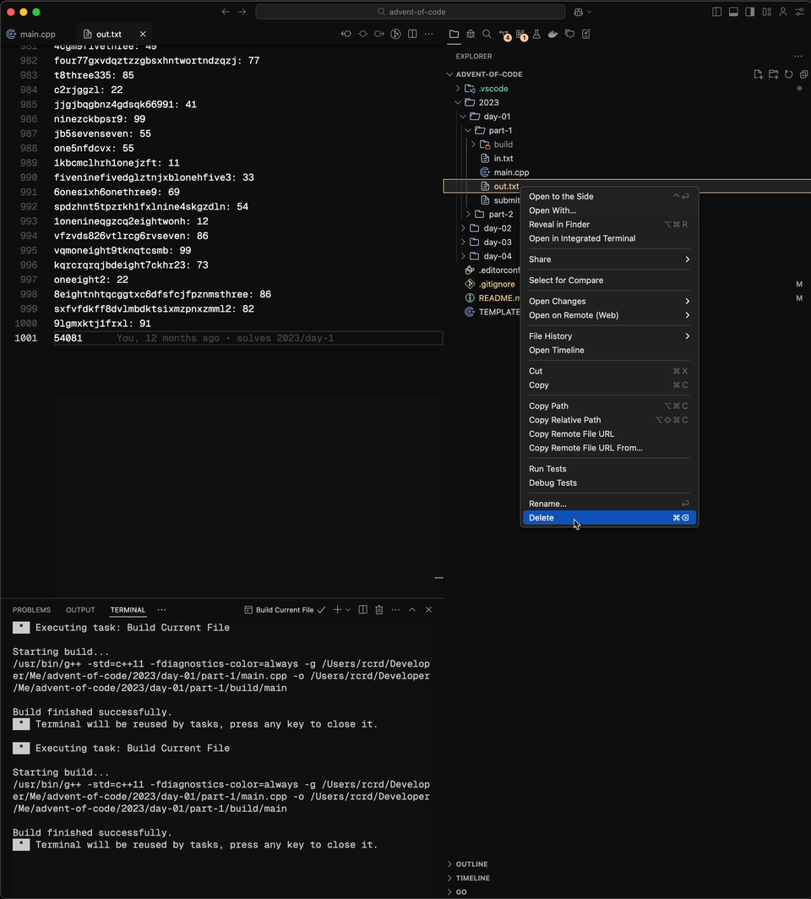
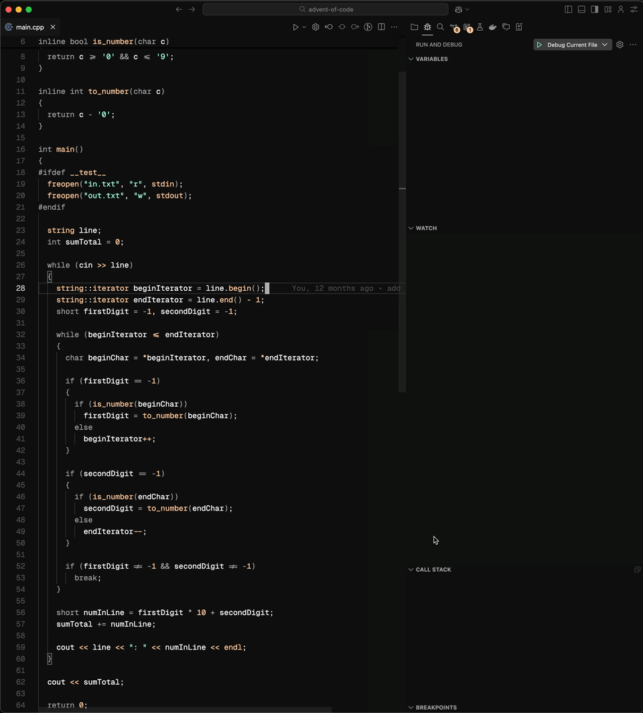

# Advent of Code

> 🎄 Feliz Navidad, Buon Natale, Merry Christmas

## Description

This repository contains my solutions for the [Advent of Code](https://adventofcode.com/) challenges.

## Structure

The repository is structured as follows:

- Each solution in well contained in a folder with the following structure:

  ```
  ./<year>/day-<day>/part-<part>
  ```

  For instance: [./2023/day-01/part-01](./2023/day-01/part-01)

- Each solution folder contains the following files:

  - `main.cpp`: The solution code.
  - `input.txt`: The input data for the solution.
  - `output.txt`: The expected output for the solution.
  - `submit.txt`: The answer to submit to the Advent of Code website.

## Run a solution

### Using VSCode

<details>
  <summary>1. Run current file</summary>
  
</details>

<details>
  <summary>2. Debug current file</summary>
  
</details>

### Manually

1. Go to any solucion folder. For instance:

   ```bash
   cd ./2023/day-01/part-01
   ```

2. Run the `main.cpp` file, which is the solution:

   ```bash
   g++ -std=c++11 -o out ./main.cpp && ./out
   ```
