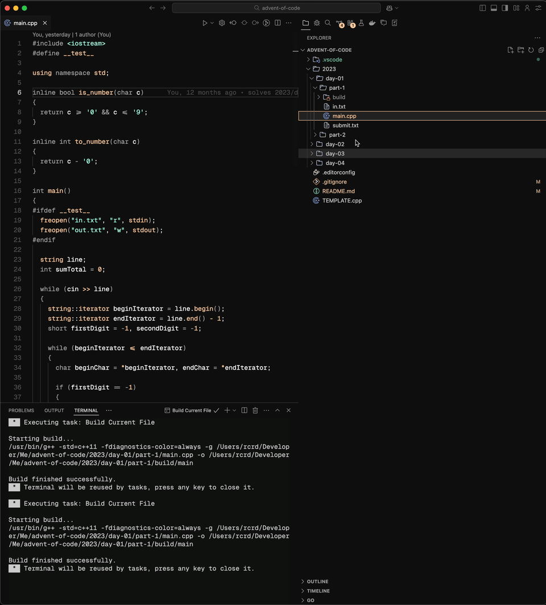

# Advent of Code

> 🎄 Feliz Navidad, Buon Natale, Merry Christmas

## Description

This repository contains my solutions for the [Advent of Code](https://adventofcode.com/) challenges.

## Structure

The repository is structured as follows:

- Each solution in well contained in a folder with the following structure:

  ```
  ./src/<year>/day-<day>/part-<part>
  ```

  For instance: [./src/2023/day-01/part-1](./src/2023/day-01/part-1)

- Each solution folder contains the following files:

  - `main.cpp`: The solution code.
  - `in.txt`: The input data from the challenge.
  - `out.txt`: The solution output.
  - `submit.txt`: The submitted answer to Advent of Code website.

## Run a solution

### Using VSCode

<details>
  <summary>1. Run current file</summary>
  
</details>

<details>
  <summary>2. Debug current file</summary>
  
</details>

### Manually

1. Go to any solucion folder. For instance:

   ```bash
   cd ./src/2023/day-01/part-1
   ```

2. Run the `main.cpp` file, which is the solution:

   ```bash
   g++ -std=c++11 -o out ./main.cpp && ./out
   ```

3. Check the output:

   ```bash
   cat out.txt
   ```

## Check a solution

There is a script that checks the solutions and compares the output with the submitted answer.

```bash
make check
```

<details>
  <summary>Example Output</summary>

    Checking ./src/2024/day-01/part-2/main.cpp
    ✅ Check passed

    Checking ./src/2024/day-01/part-1/main.cpp
    ✅ Check passed

    Checking ./src/2023/day-01/part-2/main.cpp
    ✅ Check passed

    Checking ./src/2023/day-01/part-1/main.cpp
    ✅ Check passed

    Checking ./src/2023/day-04/part-1/main.cpp
    ✅ Check passed

    Checking ./src/2023/day-03/part-2/main.cpp
    ✅ Check passed

    Checking ./src/2023/day-03/part-1/main.cpp
    ✅ Check passed

    Checking ./src/2023/day-02/part-2/main.cpp
    ✅ Check passed

    Checking ./src/2023/day-02/part-1/main.cpp
    ✅ Check passed

</details>

It will walk through all the solutions and check if the output is correct.

Optionally, you can pass a specific folder:

```bash
make check 2023/day-01/part-1
```
